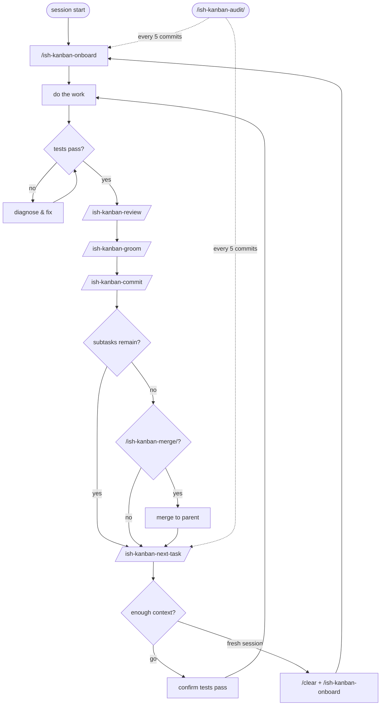

# workflow

## structure

work is organized as phases, broken into tasks.

```
ishd/
  kanban/
    workflow.md                — how work gets done (shared across boards)
    <board>/                   — one directory per board
      plan.yaml                — source of truth for task ordering
      roadmap/                 — why each phase exists
      tasks/
        <task>.md              — single task
        <task>/                — task broken into subtasks
          subtask.md
```

each board has its own `plan.yaml`, `tasks/`, and `roadmap/`. `workflow.md` is shared — it lives at `ishd/kanban/` root, not inside a board.

`plan.yaml` is the source of truth for task ordering — list position is priority. tasks and subtasks are not numbered. if a task has subtasks, it's a directory. subtask order within a directory is defined by plan.yaml.

list order in plan.yaml means execution order: do the first task, then the second. with one person working, order is all that matters. branches enable concurrent work on separate tasks (see [branches](#branches)), but plan.yaml ordering remains sequential — it defines priority, not parallelism.

## issue types

each issue type defines what artifacts it produces:

| type | code | tests | docs | plan |
|------|------|-------|------|------|
| feat | required | required | required | optional |
| fix  | required | required | required | optional |
| docs | - | - | required | - |
| plan | - | - | - | required |
| spike | - | - | required | required |
| audit | - | - | optional | required |

**feat** — new functionality. code, tests, and docs are a single unit. plan updates optional (e.g., slotting follow-on tasks).

**fix** — bug fix. same artifact requirements as feat. code, tests, and docs together.

**docs** — documentation only. design decisions, architecture updates. no code, no plan changes.

**plan** — kanban only. task creation, reordering, deletion. no code, no docs.

**spike** — a design task. output is documentation and kanban tasks. a spike is not done until its implementation tasks are on the board. spikes never produce code directly. spike workflow, one question at a time:
  1. research prior art. if project has reference docs, start there. then web research.
  2. present findings to the user.
  3. present options with tradeoffs and a recommendation.
  4. user decides. spikes do not predetermine scope — they present the full range of options with tradeoffs. the user sets scope boundaries.
  5. move to the next question. repeat 1-4 until all questions are resolved.
  6. document findings in docs, update kanban with follow-on tasks, delete spike task file, commit.

**audit** — full-project adversarial QA. finds contradictions, gaps, ambiguities, circular dependencies, and drift across docs, source, tests, kanban, and skills. produces spikes for findings. no code changes.

**grooming** is not a commit type — it's a workflow step (`/ish-kanban-groom`), run after every task. scoped to the task just completed: fix stale references, update instructions after renames or design changes, ensure affected docs and kanban tasks still meet quality standards.

## tracking

kanban tracks what's left to do. tasks are not deleted until work is done AND lessons learned are documented somewhere durable (project docs, other kanban tasks). durable means it's in git — not memory, not plan files. task files are ephemeral — once lessons are captured elsewhere, delete the task.

**completing a task:** before deleting a task file, move everything useful out of it first. design decisions go to docs. implementation details for follow-on work go into kanban tasks. the goal: nothing in the task file needs to be recreated from scratch. close the task (`ish kanban tasks close --name=<task> --board=<board>`) in the same commit as the work — the feature and the task closure are one logical change.

## writing tasks

task descriptions state what changes, what stays, and why. "remove X" is ambiguous when X appears in multiple places with different roles. say which instance is wrong and which is correct.

tasks must carry explicit, detailed instructions — enough for a future session with no conversation context to execute without guessing. include the design rationale, the specific changes, the exact content to add or remove, and why. tasks are the handoff — they must be self-contained.

## planning

when a task can't be executed in one pass — its approach is undecided, or the work is too large — break it into a directory with subtasks. planning mode produces kanban tasks, not code. the output of planning is a set of concrete, ordered tasks in the kanban — then execute them one at a time.

### decomposition

**feat (top-level):** a spike-led directory when the approach is undecided — when an open design question must be resolved before implementation. decomposes spike → docs → source/tests; the spike decides the approach, the remaining subtasks execute it. subtasks within don't further decompose. a feat whose approach is fully specified — behavior, exact changes, what-stays, and rationale all pinned, with no open question a spike would resolve — may be a standalone file. when in doubt, decompose: a needless spike costs one thin doc; a missing one costs rework.

**fix and docs:** standalone tasks, no directory, no decomposition.

### nesting

one level deep, maximum. a task is either a standalone file or a directory of flat subtasks. never nest directories inside directories. if the plan tangles — groom it until it phases cleanly. don't add depth.

## execution

every session starts with `/ish-kanban-onboard` — orient, check git state, ensure task branch, check audit cadence, study the next task, confirm tests pass. mid-session transitions use `/ish-kanban-next-task`.



1. pick the next task from the kanban.
2. ensure the task branch (onboard handles this).
3. review the task before starting. if it's not explicit enough to execute without guessing, fix it first.
4. do the work — source changes, tests, and docs are a single unit. one task, one commit.
5. user runs tests. if tests fail, diagnose together.
6. once tests pass: user runs `/ish-kanban-review`. fix issues before grooming.
7. user runs `/ish-kanban-groom`. captures lessons, closes the task.
8. user runs `/ish-kanban-commit`. drafts message from staged diff, user approves. offers merge after.
9. user runs `/ish-kanban-next-task` to transition. if context is low, recommends fresh session.

## audit cadence

`/ish-kanban-audit` is a full-project adversarial QA pass. cadence: every 5 commits.

tracking: the `audit` git tag marks the last audit commit. onboard counts commits since the tag and recommends audit when count >= 5. `/ish-kanban-commit` moves the tag after an `audit` type commit.

audits run on main. no task branch — audit changes (kanban updates, doc fixes, workflow corrections) are committed directly to main.

findings: audit findings slot at the top of `plan.yaml`, ahead of existing work. unresolved findings are debt — they go first.

## commit messages

before drafting any commit message:

1. `git log` — read recent commits for style and context.
2. `git status` — see what's staged, unstaged, and untracked.
3. `git diff --staged` — read exactly what will be committed.
4. `git diff` — see what won't be committed.
5. draft the message from the staged diff, not from memory.

```
<type>: <title>

<what and why, hemingway style>

- <non-exhaustive list of changes>
```

types: `feat`, `fix`, `docs`, `plan`, `spike`, `audit`. lowercase title, 50 chars max. body wraps at 72 chars.

## branches

every task gets a branch. branch name = `{name}/{board}/{type}/{path}`.

construction: take `git config user.email`, strip `@` and domain to get `{name}`. `{board}` is the kanban board name. `{type}` is `task` or `subtask1`. `{path}` is the task path within `tasks/`, with `.md` dropped.

### hierarchy

- standalone tasks and parent directories branch from `main`.
- subtasks branch from their parent directory branch.
- merges go back to the branch you came from.

### ownership check on remote branches

- branch starts with your name → yours, check it out.
- different name → warn, let user decide.

### lifecycle

- `/ish-kanban-onboard` and `/ish-kanban-next-task` create the branch hierarchy and switch to the task branch.
- `/ish-kanban-commit` verifies the current branch matches the task.
- `/ish-kanban-commit` offers `/ish-kanban-merge` after a successful commit.
- `/ish-kanban-merge` merges to parent and deletes the merged branch.

## collaboration

- user runs `/ish-kanban-commit` for all commits. claude drafts the message, user approves.
- user runs tests to avoid polluting context with pass confirmations.
- after each subtask: claude asks user to confirm tests pass before moving on.
- slow is smooth, then smooth is fast. follow the workflow. don't skip steps.
- design decisions that gate implementation are spikes, not inline discussion.
- kanban persists across sessions. it is the source of truth for what remains.
- all project knowledge lives in docs and kanban, not in claude's memory system.

## roles

claude surfaces situation, complication, and recommendation. claude provides research, guidance, and options. the user provides judgement and direction. claude does not make design decisions — claude presents the tradeoffs and the user decides.
